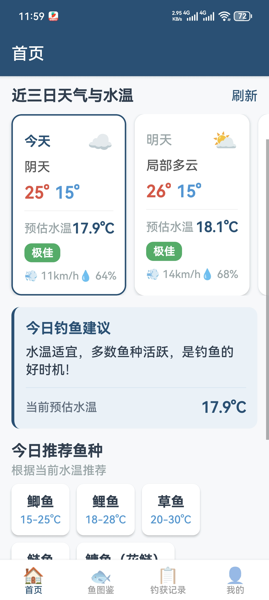
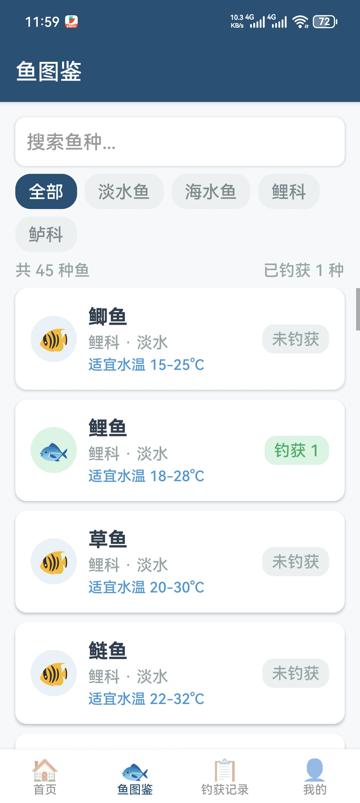
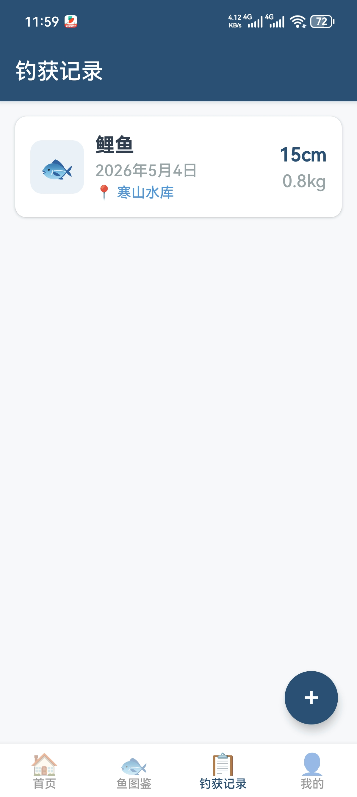
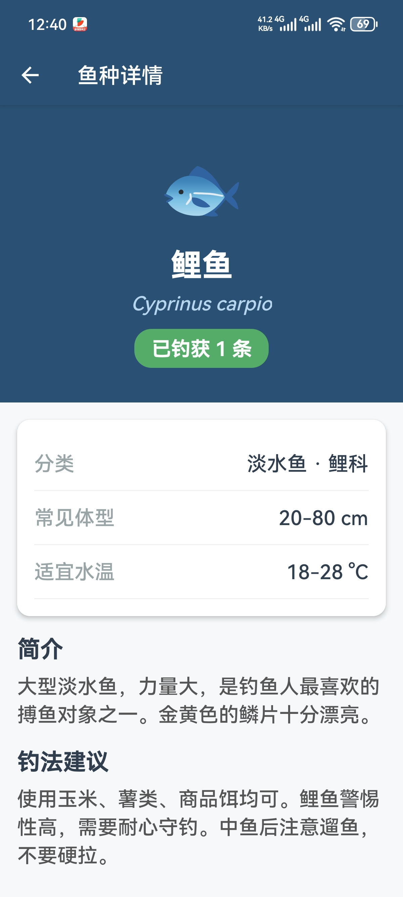
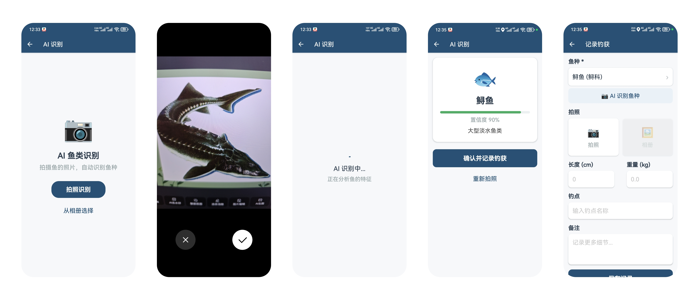

<div align="center">

# 🎣 钓鱼人宝典

**你的智能钓鱼助手**

[](https://reactnative.dev/)
[](https://expo.dev/)
[](https://www.typescriptlang.org/)
[](LICENSE)

<br />

一款专为钓鱼爱好者打造的移动端应用，集天气查询、鱼种图鉴、钓获记录和 AI 识别于一体。

[功能介绍](#-功能介绍) · [快速开始](#-快速开始) · [项目结构](#-项目结构) · [截图展示](#-截图展示) · [技术栈](#-技术栈)

</div>

---

## ✨ 功能介绍

### 🌤️ 实时天气与水温
- 自动获取 GPS 定位，实时查询 3 日天气预报
- 基于气温、风速、季节智能估算水温，区分「当前水温」和「日均水温」
- 根据水温给出钓鱼建议和鱼种推荐
- 使用 [和风天气](https://www.qweather.com/) API，**无需配置，GPS 直接定位，精度到区/县**
- 30 分钟内存 + 数据库双重缓存，打开即显示，无需等待

### 🐟 鱼种图鉴
- 内置 **40+ 种**常见淡水鱼和海水鱼数据
- 详细资料：学名、适宜水温、常见体型、钓法建议
- 按类别（淡水/海水、科属）筛选
- 关键词搜索，快速定位目标鱼种
- 自动根据当前水温推荐最佳鱼种

### 📝 钓获记录
- 记录每一条钓获：鱼种、尺寸、重量、钓点、时间、备注
- 拍照留念（支持相机拍摄和相册选择）
- 生成精美分享卡片，一键分享到社交媒体
- 丰富的统计：总钓获、鱼种数量、最大鱼记录
- 成就系统：初出茅庐 → 小有斩获 → 鱼种猎人 → 大物猎手

### 🤖 AI 鱼类识别
- 拍照或从相册选择照片，AI 自动识别鱼种
- 基于 [智谱 AI GLM-4V-Flash](https://open.bigmodel.cn) 视觉模型（免费）
- 显示识别置信度和鱼种描述
- 识别后一键跳转记录钓获
- 未配置 API Key 时有明确引导，不会静默失败

### ⚙️ 个性化设置
- 单位偏好：支持 cm/inch、kg/lb、°C/°F 切换，全局生效
- API 配置：智谱 AI Key 在 app 内设置，存储于本地
- 天气 API Key 内置，无需用户配置

### 🚨 稳定性
- 全局 ErrorBoundary 捕获渲染异常，避免白屏崩溃
- 天气 API 失败自动回退到模拟数据
- 所有异步操作有完善的错误处理

### 🎨 设计亮点

- 清爽的蓝白配色，符合钓鱼场景
- Emoji 图标，无需额外图标库
- 流畅的页面切换和加载动画
- 支持 Android 平板和手机
- 启用 React Native New Architecture，性能更优

---

## 📸 截图展示

<div align="center">

| 首页 | 鱼种图鉴 | 钓获记录 | 钓获详情 |
|:---:|:---:|:---:|:---:|
|  |  |  |  |

### 🤖 AI 智能识别



> 📌 截图持续更新中

</div>

---

## 🚀 快速开始

### 环境要求

- **Node.js** >= 18
- **npm** >= 9
- **Android SDK** (本地构建 APK 需要)
- **Java JDK** >= 17

### 安装与运行

```bash
# 1. 克隆仓库
git clone https://github.com/sakura-love/fishing-app.git
cd fishing-app

# 2. 安装依赖
npm install

# 3. 启动开发服务器
npx expo start
```

### 构建 APK

```bash
# 1. 生成原生 Android 项目
npx expo prebuild --platform android

# 2. 构建 Release APK
cd android
.\gradlew.bat assembleRelease  # Windows
# 或
./gradlew assembleRelease       # macOS / Linux

# 3. APK 输出路径
# android/app/build/outputs/apk/release/app-release.apk
```

> 💡 **首次构建**需要下载 Gradle 依赖，可能需要 5-15 分钟。后续构建会快很多。
>
> 如果下载缓慢，可以在 `android/build.gradle` 的 `repositories` 中添加阿里云镜像：
> ```gradle
> maven { url 'https://maven.aliyun.com/repository/public' }
> maven { url 'https://maven.aliyun.com/repository/google' }
> ```

---

## 📁 项目结构

```
fishing-app/
├── app/                        # 页面路由（Expo Router）
│   ├── _layout.tsx             # 根布局（ErrorBoundary 包裹）
│   ├── identify.tsx            # AI 识别页
│   ├── (tabs)/                 # Tab 导航页面
│   │   ├── index.tsx           # 首页（天气 + 推荐）
│   │   ├── encyclopedia.tsx    # 鱼种图鉴
│   │   ├── records.tsx         # 钓获记录列表
│   │   └── profile.tsx         # 个人中心
│   ├── catch/                  # 钓获相关
│   │   ├── new.tsx             # 新建钓获记录
│   │   └── [id].tsx            # 钓获详情
│   ├── fish/
│   │   └── [id].tsx            # 鱼种详情
│   └── settings/
│       ├── api.tsx             # API 配置
│       ├── units.tsx           # 单位偏好
│       └── about.tsx           # 关于页
├── components/                 # 可复用组件
│   ├── ErrorBoundary.tsx       # 全局错误边界
│   ├── ShareCard.tsx           # 分享卡片
│   └── WeatherCard.tsx         # 天气卡片
├── data/                       # 数据
│   └── fish-encyclopedia.ts    # 鱼种数据库（40+ 种）
├── hooks/                      # React Hooks
│   ├── useCatches.ts           # 钓获记录状态管理（Zustand）
│   ├── useWeather.ts           # 天气与定位
│   └── useUnits.ts             # 单位偏好管理
├── services/                   # 服务层
│   ├── types.ts                # TypeScript 类型定义
│   ├── storage.ts              # SQLite 本地存储
│   ├── weather.ts              # 和风天气 API
│   └── fish-recognition.ts     # AI 鱼类识别
├── utils/                      # 工具函数
│   ├── crypto.ts               # API Key 混淆工具
│   ├── share.ts                # 分享工具
│   └── water-temp.ts           # 水温估算算法
├── assets/                     # 静态资源（图标、启动屏）
├── app.json                    # Expo 配置
├── eas.json                    # EAS Build 配置
└── package.json                # 项目依赖
```

---

## 🛠️ 技术栈

| 技术 | 用途 |
|:---|:---|
| **React Native 0.81** | 跨平台移动应用框架（New Architecture） |
| **Expo SDK 54** | 开发工具链和原生模块 |
| **Expo Router v6** | 基于文件系统的路由 |
| **TypeScript 5.9** | 类型安全的 JavaScript |
| **Zustand** | 轻量级状态管理 |
| **expo-sqlite** | 本地数据库存储 |
| **expo-location** | GPS 定位与地理编码 |
| **expo-image-picker** | 相机与相册访问 |
| **expo-camera** | 相机实时拍摄 |
| **expo-sharing** | 系统分享功能 |
| **react-native-view-shot** | 截图用于分享 |
| [和风天气 API](https://www.qweather.com/) | 天气预报与地理编码 |
| **智谱 AI GLM-4V** | 免费视觉识别模型 |

---

## 🔑 API 说明

| API | 是否需要 Key | 用途 |
|:---|:---:|:---|
| [和风天气](https://www.qweather.com/) | ❌ 不需要 | 天气预报、地理编码、水温估算 |
| [智谱 AI](https://open.bigmodel.cn) | ⚙️ 可选 | AI 鱼类识别（免费模型） |

> 天气功能开箱即用，AI 识别需要在应用内「我的 → API 配置」中填入智谱 AI 的 API Key。不配置也可以使用，会提示配置。

---

## 🤝 贡献

欢迎提交 Issue 和 Pull Request！

1. Fork 本仓库
2. 创建功能分支：`git checkout -b feature/amazing-feature`
3. 提交更改：`git commit -m 'feat: add amazing feature'`
4. 推送分支：`git push origin feature/amazing-feature`
5. 提交 Pull Request

---

## 📜 开源协议

本项目基于 [CC BY-NC-SA 4.0](LICENSE) 许可证开源。

✅ 允许：分享、改编、非商业使用
❌ 禁止：商业用途
📋 要求：注明出处、相同方式共享

---

<div align="center">

**如果觉得有用，给个 ⭐ Star 支持一下吧！**

Made with ❤️ for fishing enthusiasts

</div>